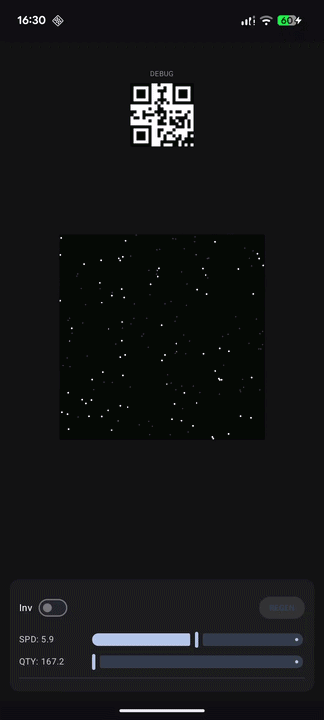
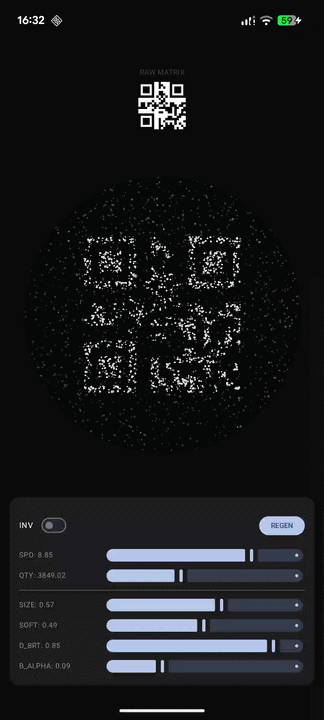
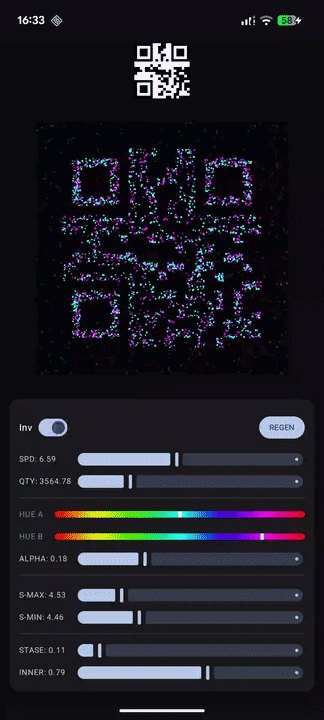
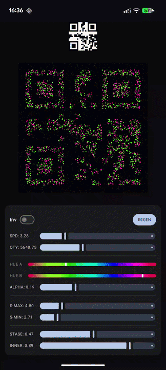

# Hybrid QR Engine  
### Hybrid CPU/GPU Kinetic Rendering for Structured Data

Hybrid QR Engine is an experimental rendering system for Android that reinterprets QR matrices through a hybrid CPU/GPU graphics pipeline.

Instead of statically drawing square modules, the engine transforms QR data into a dynamic particle field constrained by spatial logic and GPU masking.

This project explores motion-based structural rendering while preserving strict matrix topology.

---

| Logical Prototype | Progressive Upgrade | Full Configuration | Alternate Config |
|:--:|:--:|:--:|:--:|
|  |  |  |  |

---

## Architectural Overview

The system is divided into two explicit layers:

### 1. CPU Kinetic Simulation

A deterministic particle engine drives motion and spatial behavior.

- Pre-allocated fixed-size buffers (FloatArray / IntArray)
- No runtime memory allocation during animation
- O(n) per-frame particle update
- Velocity modulation based on module classification
- Data-zone resistance ("stase" effect)
- Bitmap-backed module sampling

Particles are not randomly distributed.  
Their motion is constrained by QR module classification sampled in real time.

This creates density contrast through velocity reduction rather than static opacity.

---

### 2. GPU Structural Reconstruction (AGSL)

An AGSL RuntimeShader reconstructs QR topology directly on the GPU.

Responsibilities:

- Module coordinate reconstruction (21×21 grid)
- Data vs background classification
- Polarity inversion
- Chromatic blending
- Boundary-safe masking

The shader guarantees spatial coherence and preserves logical structure independently from the kinetic layer.

Rendering logic and data logic remain decoupled.

---

## Rendering Model

The engine does not simulate noise or probabilistic dithering.

Instead, it relies on:

- Spatial constraint fields
- Motion resistance inside data modules
- Controlled particle size variance
- Chromatic separation between structural zones

The QR becomes perceptible through motion clustering rather than rigid block rendering.

---

## Feature Set

- QR Version 1 topology (21×21)
- Up to 15,000 concurrent particles
- Live particle count scaling
- Speed multiplier control
- Data polarity inversion
- Dual hue chromatic configuration
- Background alpha modulation
- Particle size min/max control
- Inner render scaling
- Adjustable data-zone resistance
- Real-time matrix regeneration (mock generator)

---

## Performance Characteristics

- Single allocation particle buffers
- Stable frame-time under max particle load (device dependent)
- CPU-bound motion simulation
- GPU-bound structural masking and compositing
- Hardware acceleration required
- Designed for Android 13+ (AGSL dependency)

---

## Technical Stack

- Kotlin 2.x
- Jetpack Compose
- Native Canvas drawing
- AGSL RuntimeShader
- Android API 33+

---

## Current Scope & Limitations

- Uses internal QR mock generator (no encoder integration yet)
- Optimized for Version 1 matrices
- Experimental rendering engine
- Not intended as a production QR library

Scannability depends on contrast configuration and device camera processing.

---

## Research Intent

This project investigates:

- Hybrid CPU/GPU rendering separation
- Motion-based reinterpretation of structured machine data
- Shader-driven structural masking
- Real-time uniform orchestration in Compose
- Performance characteristics of high-count particle systems on Android

It serves as a graphics engineering exploration rather than a utility implementation.

---

## Requirements

- Android 13 (API 33) or higher
- Device supporting AGSL RuntimeShader
- Hardware acceleration enabled

---
`Built as an exploration of hybrid rendering systems on modern Android.`
